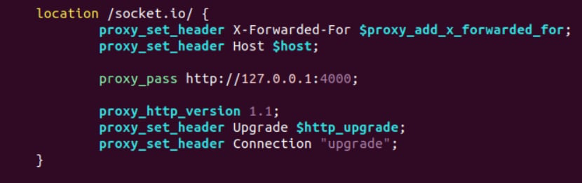

# Hệ Thống Chia Sẻ Công Thức và Thông Tin Dinh Dưỡng

**Admin**: [https://admin.duynghia-vku.website/](https://admin.duynghia-vku.website/)

**Client**: [https://duynghia-vku.website/](https://duynghia-vku.website/)

---

### Hướng Dẫn Vào Server Tại Máy Local Mà Không Cần Phải Vào Web AWS

- Mình đã config ssh vào trong máy tính rồi, nên chỉ cần chạy lệnh này là có thể remote vào server:

```bash
ssh aws-server
```

- Đẩy source lên AWS:

```bash
  rsync -avz -e "ssh -i ~/Desktop/duynghia123.pem" ~/Downloads/Nutritional-Info-Recipe-System ubuntu@54.251.89.183:~/
```

- Vào server AWS tại local thay vì vào trang AWS:

```bash
  ssh -i ~/Desktop/duynghia123.pem ubuntu@54.251.89.183
```

- Thay vì dùng lệnh trên dài quá thì gõ lệnh này (mình đã config trong ssh rồi):

```bash
ssh aws-server
```

- Lệnh để cấu hình nginx:

  sudo vim /etc/nginx/sites-available/default



- Sau khi deploy lên server -> nếu server sập, hết hạn mức free thì sửa link này:

  thay http://localhost:4000 thành https://duynghia-vku.website

---

## Giới Thiệu Đồ Án

Đây là đồ án tốt nghiệp của **Lê Nguyễn Duy Nghĩa**, sinh viên Trường Đại học Công nghệ Thông tin và Truyền thông Việt - Hàn, lớp 20SE4. Đồ án được thực hiện dưới sự hướng dẫn của **ThS. Đặng Thị Kim Ngân**.

- **Video Demo**: [https://www.youtube.com/watch?v=HaXA2q52fBg](https://www.youtube.com/watch?v=HaXA2q52fBg)
- **Ảnh Visually Data Model**: `DATN.mm` (sử dụng tool Moon Modeler để xem file này)

### Giới Thiệu Tool Moon Modeler

- Moon Modeler là một công cụ mô hình hóa dữ liệu, cho phép định nghĩa trực quan các mô hình dữ liệu cho cơ sở dữ liệu NoSQL. Công cụ hỗ trợ vẽ sơ đồ, trực quan hóa cơ sở dữ liệu hiện có và tạo mã script.
- **Link Tool**: [https://www.datensen.com/data-modeling/moon-modeler-for-databases.html](https://www.datensen.com/data-modeling/moon-modeler-for-databases.html)

---

## Mục Lục

- [Giới Thiệu](#giới-thiệu)
- [Mục Tiêu](#mục-tiêu)
- [Đối Tượng và Phạm Vi](#đối-tượng-và-phạm-vi)
- [Phương Pháp Thực Hiện](#phương-pháp-thực-hiện)
- [Kết Quả Dự Kiến](#kết-quả-dự-kiến)
- [Ý Nghĩa Khoa Học và Thực Tiễn](#ý-nghĩa-khoa-học-và-thực-tiễn)
- [Tiến Độ Thực Hiện](#tiến-độ-thực-hiện)
- [Hướng Phát Triển Tương Lai](#hướng-phát-triển-tương-lai)
- [Thông Tin Liên Hệ](#thông-tin-liên-hệ)

---

## Giới Thiệu

Trong bối cảnh quan tâm đến sức khỏe ngày càng gia tăng, đặc biệt là sau đại dịch, nhu cầu về một hệ thống tích hợp thông tin dinh dưỡng và công thức nấu ăn trở nên quan trọng hơn bao giờ hết. Các nền tảng hiện tại thường thiếu kết nối giữa món ăn và giá trị dinh dưỡng, gây khó khăn cho người dùng trong việc quản lý chế độ ăn uống và sức khỏe cá nhân. Dự án này nhằm giải quyết vấn đề đó bằng cách tạo ra một nền tảng kết hợp giữa chia sẻ công thức, theo dõi dinh dưỡng và quản lý sức khỏe.

---

## Mục Tiêu

Các mục tiêu chính của dự án bao gồm:

1. Phát triển nền tảng tích hợp giữa chia sẻ công thức nấu ăn và thông tin dinh dưỡng.
2. Tạo diễn đàn cho người dùng chia sẻ kinh nghiệm nấu ăn và kiến thức dinh dưỡng.
3. Cung cấp các chức năng hỗ trợ theo dõi sức khỏe và gợi ý chế độ ăn uống phù hợp.
4. Triển khai tính năng tìm kiếm công thức qua hình ảnh để cải thiện trải nghiệm người dùng.

---

## Đối Tượng và Phạm Vi

- **Đối Tượng**: Người dùng có nhu cầu tìm kiếm thông tin về nấu ăn và dinh dưỡng.
- **Phạm Vi**: Hệ thống sẽ là một ứng dụng web sử dụng ReactJS, NodeJS và MongoDB với các tính năng như chia sẻ món ăn, tìm kiếm bằng hình ảnh và quản lý sức khỏe.

---

## Phương Pháp Thực Hiện

Dự án thực hiện theo các bước:

1. **Khảo Sát và Phân Tích**: Nghiên cứu các hệ thống hiện có và xác định nhu cầu người dùng.
2. **Thiết Kế Hệ Thống**: Xây dựng kiến trúc hệ thống và giao diện người dùng.
3. **Phát Triển Tính Năng**: Xây dựng các chức năng chính như chia sẻ công thức, theo dõi sức khỏe và tìm kiếm bằng hình ảnh.
4. **Kiểm Thử và Triển Khai**: Đảm bảo tính ổn định và hiệu suất của hệ thống.

---

## Kết Quả Dự Kiến

- Một hệ thống hoạt động hiệu quả, đáp ứng nhu cầu chia sẻ thông tin dinh dưỡng và công thức nấu ăn của người dùng.
- Giao diện thân thiện, dễ sử dụng với các tính năng tiện ích.
- Khả năng tương tác cao và thu hút sự tham gia của người dùng.

---

## Ý Nghĩa Khoa Học và Thực Tiễn

Dự án này cung cấp giải pháp tích hợp giữa món ăn và dinh dưỡng, giúp người dùng có cái nhìn tổng quan về chế độ ăn uống và sức khỏe. Với các thông tin dinh dưỡng hữu ích và nền tảng chia sẻ công thức, dự án góp phần nâng cao chất lượng cuộc sống của người dùng.

---

## Tiến Độ Thực Hiện

| STT | Thời Gian                 | Nội Dung Thực Hiện                                |
| --- | ------------------------- | ------------------------------------------------- |
| 1   | 01-09-2024 đến 21-09-2024 | Xây dựng đề cương chi tiết và xác nhận với trường |
| 2   | 22-09-2024 đến 30-09-2024 | Nghiên cứu và phân tích tài liệu liên quan        |
| 3   | 01-10-2024 đến 15-10-2024 | Hoàn thành phân tích yêu cầu và thiết kế hệ thống |
| 4   | 16-10-2024 đến 31-10-2024 | Phát triển giao diện và cơ sở dữ liệu             |
| 5   | 01-11-2024 đến 15-11-2024 | Phát triển các tính năng chính                    |
| 6   | 16-11-2024 đến 30-11-2024 | Kiểm thử hệ thống và tối ưu                       |
| 7   | 01-12-2024 đến 15-12-2024 | Hoàn thiện hệ thống và viết báo cáo               |
| 8   | 16-12-2024 đến 21-12-2024 | Chuẩn bị và chỉnh sửa báo cáo                     |
| 9   | 22-12-2024                | Nộp kết quả thực hiện đề tài                      |

---

## Hướng Phát Triển Tương Lai

- Mở rộng tính năng lên kế hoạch ăn uống chi tiết.
- Tích hợp học máy để đề xuất chế độ dinh dưỡng và sức khỏe cá nhân.
- Nâng cao tính năng tìm kiếm bằng hình ảnh với công nghệ AI.

---

## Thông Tin Liên Hệ

- **Email**: lndnghia.20it7@vku.udn.vn
- **LinkedIn**: [https://www.linkedin.com/in/duynghiale/](https://www.linkedin.com/in/duynghiale/)
