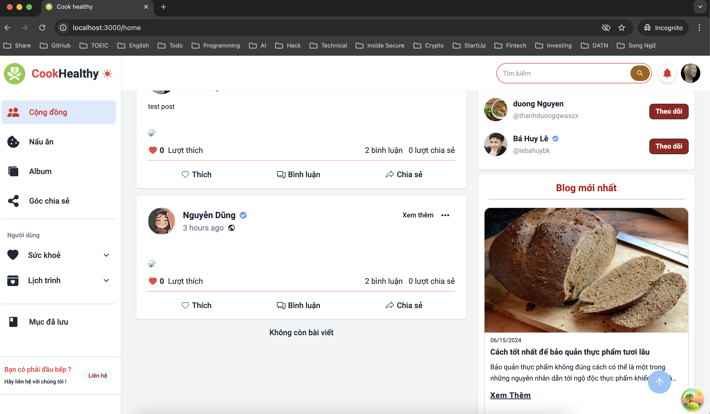
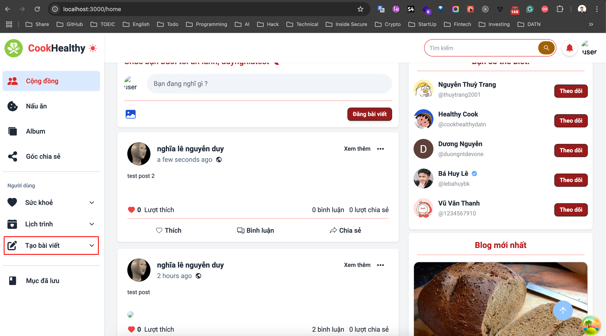
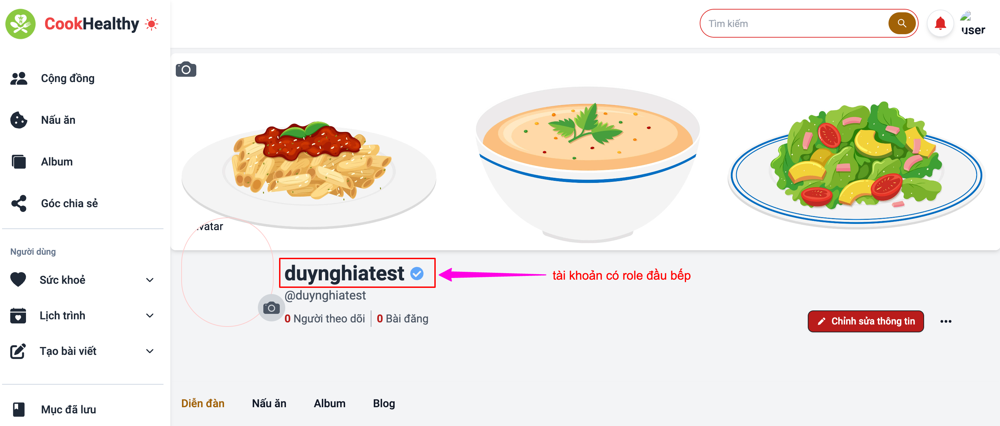

# Trong project Đồ Án Tốt Nghiệp mình cần tạo những tài khoản này:

- tạo tk aws: https://www.youtube.com/watch?v=JWOscrg9EZ4 -> sử dụng tài khoản `duynghiadev`
- google id: -> dùng tài khoản của bạn `Đức`
- thuê người crawl data về thông tin dinh dưỡng -> phí `500k`
- thuê Phạm Đức (owner project) làm giúp -> phí: thi xong đồ án -> bạn đó nhận `500k`

---

## Tài khoản AWS

**account aws:**

-> lưu ý khi đăng nhập, khi mình vào page aw2 thì mình click vào chỗ `using email root` -> rồi sử dụng tài khoản phía trên (`duynghiadev@gmail.com`) để login vào

duynghiadev@gmail.com
Duynghia@123

---

- Muốn có role đầu bếp thì phải nâng cấp, khi nâng cấp lên thì sẽ được gửi đến server (localhost:4000), mình phải đó xác nhận, xong quay lại user đó sẽ thấy có dấu tick màu xanh
- tài khoản mà có role đầu bếp thì nó sẽ khác với tài khoản bình thường

  - tài khoản bình thường thì được đăng bài viết bình thường, nhưng không có mục tạo bài viết
  - đây là hình ảnh tài khoản thường
    

  - tài khoản có role đầu bếp thì sẽ có mục tạo bài viết
  - đây là hình ảnh có role là đầu bếp
    
    

---

- admin:: full quyền
- người đăng bài
- người kiểm duyệt

---

- **Tiêu chi lên được role đầu bếp:**
  - Đủ 2 follow thì user đó tự lên role đầu bếp (**`reason: 'Đủ 2 follow'`** -> đoạn đó trong code, trước đó là 3, mình đã sửa lại 2). Khi user đã đủ 2 folder thì khi request lên server thì sẽ hiện role **`đủ follow`**

---

## trong web này mình có thể tạo 3 role:

- Những tài khoản này có mật khẩu mặc định là `123456789Dd@` đã fix cứng vào trong db
- nếu muốn sửa thì mình vào thẳng vào trong db mà fix (mình đã sửa lại 3 tài khoản dưới đó thành mật khẩu là `Duynghia@123` -> có mã hash là `$2b$10$JRFcor7dAK0oRnfgbvR7cum7BooRCgUjLo9ezXfVt37rNhGPEU9eW`)
- khi tạo `người kiểm duyệt` và `người viết bài` mới thì có mật khẩu mặc định -> sau đó mình vào db tìm tên username mà mình vừa tạo -> sau đó sửa pass lại thành `Duynghia@123` bằng cách copy đoạn mã hash đó và paste vào

**account source owner (localhost://8080)**

- admin
- Duynghia@123

**account người kiểm duyệt**

- username: inspector2
- email: inspector2@gmail.com
- password: Duynghia@123

**account người viết bài**

- username: writer2
- email: write2@gmail.com
- password: Duynghia@123

---
