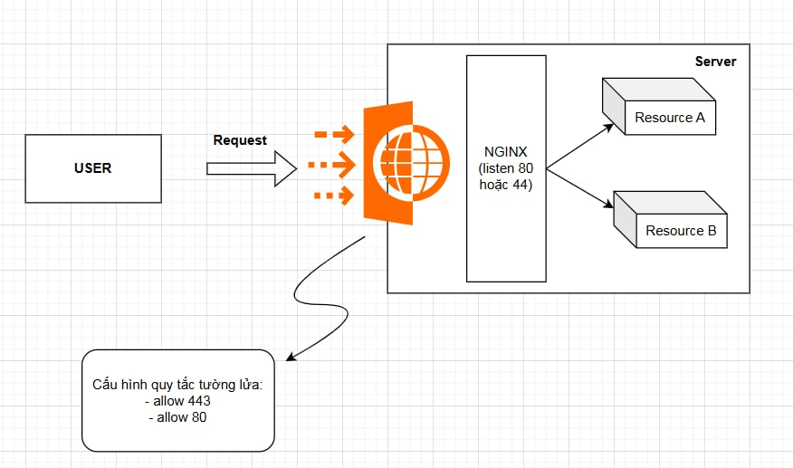

# Giải thích các port của từng folder

- DATN_BE: http://localhost:4000/

  - Chứa API và xử lý logic phía back-end

- DATN_FE: http://localhost:3000/

  - Code giao diện
  - Gọi API từ back-end lên và render ra màn hình

- DATN_ADMIN_FE: http://localhost:8080/
  - Trong source này code ra trang giao diện quản trị
  - Trong source đó chỉ gọi các API phần quảng trị, và chỉ có user do admin tạo ra mới được login vào link này

---

# Dự án mình đưa lên cloud (sử dụng AWS EC2)

- Trong dự án mình có sử dụng những phần này, cần tìm hiểu kỹ để thuyết trình giải thích cho các giám khảo hiểu:
  - Nginx là một phần mềm mã nguồn mở, được sử dụng để làm máy chủ web và reverse proxy
  - Kiểu nó ánh xạ cái request bên ngoài vào trong cái máy chủ của mình
  - Sẽ cấu hình đường đi trong nớ

# Hệ Thống Chia Sẻ Công Thức và Thông Tin Dinh Dưỡng

**Admin**: [https://admin.duynghia-vku.website/](https://admin.duynghia-vku.website/)

**Client**: [http://localhost:4000/](http://localhost:4000/)

---

### Hướng Dẫn Vào Server Tại Máy Local Mà Không Cần Phải Vào Web AWS

- Mình đã config ssh vào trong máy tính rồi, nên chỉ cần chạy lệnh này là có thể remote vào server:

```bash
ssh aws-server
```

- Đẩy source lên AWS:

```bash
	rsync -avz -e "ssh -i ~/Desktop/duynghia123.pem" ~/Downloads/Nutritional-Info-Recipe-System ubuntu@54.251.89.183:~/
```

- Vào server AWS tại local thay vì vào trang AWS:

```bash
	ssh -i ~/Desktop/duynghia123.pem ubuntu@54.251.89.183
```

- Thay vì dùng lệnh trên dài quá thì gõ lệnh này (mình đã config trong ssh rồi):

```bash
ssh aws-server
```

- Lệnh để cấu hình nginx:

```bash
	sudo vim /etc/nginx/sites-available/default
```

- Cấu hình tường lửa trong project, mình chưa cấu hình
- Tham khảo: [set-up-firewall](https://www.digitalocean.com/community/tutorials/how-to-set-up-a-firewall-with-ufw-on-ubuntu)

  
